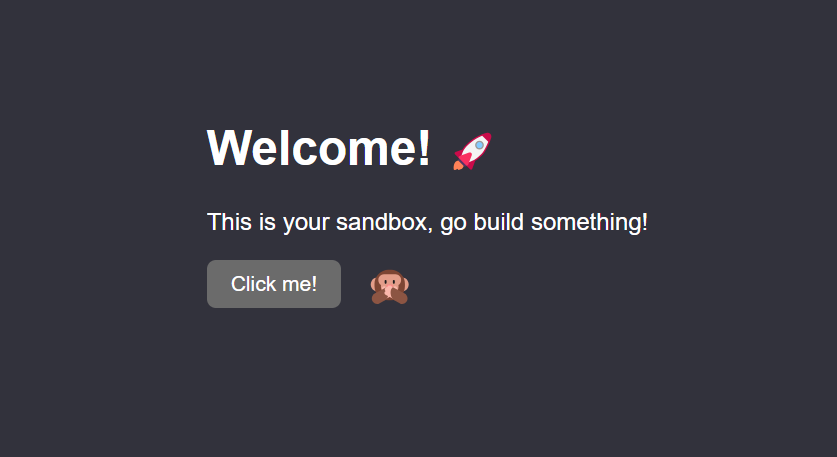

# sandman

Command line utility to create a quick web sandbox.



## How to install

1. Make sure [Go](https://go.dev) is installed on your system
2. Run the following command to install directly from the repo:

```
go install github.com/nelsonr/sandman@latest
```

## How to use

To create a sandbox named `my-sandbox` run the following command:

```
sandman my-sandbox
```

It will create a sandbox with the following structure:

```
my-sandbox
├── index.html
├── style.css
└── script.js
```

### Serving the sanbox

Nowadays, there's plenty of static HTTP servers around. Rather than reinventing
the wheel, here's some suggestions to choose from:

- [live-server](https://github.com/tapio/live-server) - Node.js
- [golive](https://github.com/Debdut/golive) - Go
- [static-web-server](https://static-web-server.net/) - Rust

## Development

Relevant project files:

```
├── main.go
├── install.sh
└── assets
    ├── index.html
    ├── style.css
    └── script.js
```

The `main.go` file contains the main source code.

The `install.sh` shell script will compile and install the executable into
`~/.local/bin/` directory (it assumes it already exists).

The files inside the `assets` directory are the files generated when the sandbox
is created. Change the contens of the `assets` directory and compile again to
create your own custom sandbox generator.
